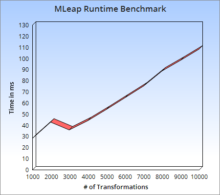
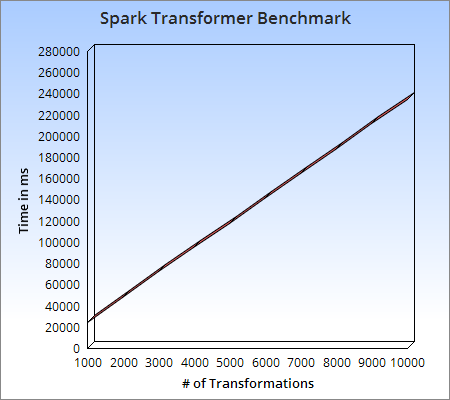

# MLeap: Release Spark ML Pipelines

If you work at a company that uses machine learning, this problem may be all too familiar: data scientists use a myriad tools to analyze, clean, and build offline ML models only to throw the work over to an engineering team when it comes time to deploy. The engineers take the work of the data scientists, completely reproduce it in a different environment, validate it against the original models, and through many hours of work, productionize the ML model. We can do better than this. There are already several solutions out there for productionizing ML pipelines like prediction.io, H2O.ai, and y-hat among others. MLeap offers a unique solution to the problem by allowing you to directly export Spark models built with Spark ML to the production-ready MLeap runtime. Let's take a look at an example of how we can build a production-ready pipeline in Spark and deploy it to a RESTful API server within minutes. For our example we will analyze a dataset from Airbnb and try to predict the price of a listing based on several features.

## The Dataset

Let's take a look at the data in our Airbnb dataset and the variables we will be using to generate our ML pipelines. This is a set of all Airbnb listings taken from: [Inside Airbnb](http://insideairbnb.com/get-the-data.html). Our dependent (label) variable will be price, which is the price per night for that listing. Here are the features we will use.

### Continuous features

* bathrooms
* bedrooms
* security\_deposit
* cleaning\_fee
* extra\_people
* number\_of\_reviews
* review\_scores\_rating

### Categorical features

* room\_type
* host\_is\_super\_host
* cancellation\_policy
* instant\_bookable

## The Pipeline

We are going to train a random forest regression model to predict the price of the listing. We will do this in two steps:

1. We will train the feature pipeline against our complete dataset
2. We will train the random forest regression against a randomly-split training dataset

Our feature pipeline can be broken into the following steps:

1. Assemble the continuous features into a vector
2. Scale the continuous feature vector
3. String index our categorical features
4. Assemble the categorical feature indices into a vector
5. Assemble the scaled continuous features and categorical indices vector into one final output feature vector used for model training

## Train the Model

Train the ML pipeline using the `TrainDemoPipeline` driver included in the demo code.

### Install SBT

If you haven't done so already, install [SBT](http://www.scala-sbt.org/). It is a build tool similar to Maven or Ant that is primarily used with Scala projects.

If you have Brew, just type in this command:

```
brew install sbt
```

### Get the Demo Source Code

```
git clone https://github.com/TrueCar/mleap-demo.git
cd mleap-demo
```

### Download the Training Dataset

```
curl https://s3-us-west-1.amazonaws.com/mleap/blog-2016-3-5/airbnb.csv.gz -o /tmp/airbnb.csv.gz
gunzip /tmp/airbnb.csv.gz
```

### Build the Demo Assembly and Train the Model

If you downloaded the sample dataset to `/tmp/airbnb.csv`, then run the command with these values:

```
sbt "demo/run /tmp/airbnb.csv file:/tmp/transformer.mleap"
```

## Deploy a JSON API Server

Next we will take the MLeap model and deploy it using our demo API server.

### Start the Demo API Server

```
sbt "server/run /tmp/transformer.mleap"
```

This will fire up a local server running on port 8080 that is ready to transform incoming LeapFrames. Let's try a sample CURL command. Download our sample `frame.json` file, we will send it to our server to transform and get the results back.

### Download the Sample LeapFrame

```
curl https://s3-us-west-1.amazonaws.com/mleap/blog-2016-3-5/frame.json -o /tmp/frame.json
```

### Predict a Listing Price

```
curl -v -XPOST \
-H "content-type: application/json" \
-d @/tmp/frame.json http://localhost:8080/transform
```

And voilà, we have our transformed LeapFrame with our price prediction as the last value in the array. This transformation did not use a SparkContext, and we did not have to include any Spark libraries to make it happen. On average, the actual transformation time is about __.011ms__, with serialization/deserialization taking up the majority of time in our API server. If we were to take the simple approach of Kryo serializing our Spark pipeline then running it with a local SparkContext on our API server, average transformation time increases to __22ms__. MLeap transformations currently execute around __2000x__ faster than out-of-the box Spark transformations for one-off requests.

## Benchmarks

Benchmarks were performed on a Macbook Pro 2.8GHz Intel Core I7 with 16GB of RAM.

Java Info (OracleJDK):

* java version "1.8.0_25"
* Java(TM) SE Runtime Environment (build 1.8.0_25-b17)
* Java HotSpot(TM) 64-Bit Server VM (build 25.25-b02, mixed mode)

Scala Version 2.11.7

### MLeap Runtime Benchmark

This benchmark takes the transformer we built then transforms the sample dataframe over and over again. As expected, transformation time increases linearly with the number of transformations performed. For this transformation, the average time to transform is about __.011ms__.



### Spark Benchmark

This benchmark takes the Spark transformer we built then transforms the sample dataframe using a SparkContext over and over again. We are trying to simulate what it would be like if we were to serialize our Spark pipelines with Kryo, load them into an API server, and execute them with realtime one-off requests using a local SparkContext with master set to "local[2]". Every single request requires the creation of a plan for the DataFrame. This is an expensive operation, hence why we see the reduced performance speed. The average time for a transform pipeline to execute is about __22ms__.



## Get the Code/Data

Get the code for the demo at [https://github.com/TrueCar/mleap-demo](https://github.com/TrueCar/mleap-demo)

```
git clone https://github.com/TrueCar/mleap-demo.git
```

Get the source code for MLeap at [https://github.com/TrueCar/mleap](https://github.com/TrueCar/mleap)

```
git clone https://github.com/TrueCar/mleap.git
```

MLeap is pushed to Sonatype snapshots, so all you have to do is include it as a dependency of your project:

```
// I just want to run my MLeap pipeline
libraryDependencies += "com.truecar.mleap" %% "mleap-runtime" % "0.1-SNAPSHOT"

// I want to train a Spark pipeline and export it to MLeap
libraryDependencies += "com.truecar.mleap" %% "mleap-spark" % "0.1-SNAPSHOT"
```

## How to Contribute

1. Try using MLeap for a project at your company and tell us how it works out!
2. File a bug report or feature request in the github tracker.
3. Contribute an estimator/transformer pair to the project.
4. Create a pull request with a feature or bug fix.
5. [https://github.com/TrueCar/mleap](https://github.com/TrueCar/mleap)
